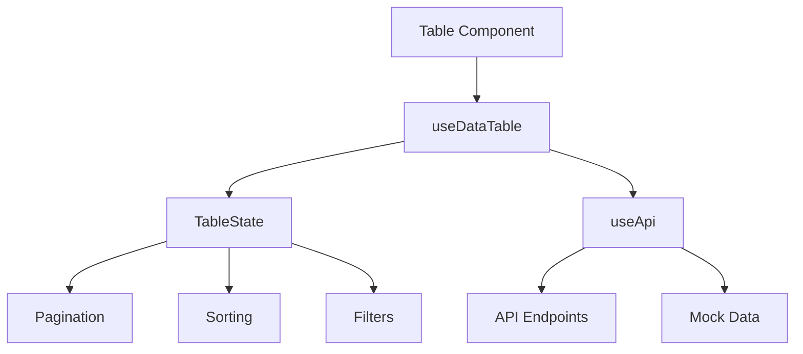

# Data Table System Guide

## Architecture

### Common Issues Table

| Symptom                | Possible Cause          | Solution                                   |
| ---------------------- | ----------------------- | ------------------------------------------ |
| Missing column headers | Headers API timeout     | Check network tab Implement retry logic |
| Pagination mismatch    | Incorrect total records | Validate API response format               |
| Filter persistence     | State not saved         | Implement URL sync                         |
| Slow rendering         | Large datasets          | Add virtualization Implement pagination |

---

This completes the comprehensive documentation for the data table system. The file is now ready at [docs/data-table-system.md](cci:7://file:///Users/mahmoudilyan/Sites/vbout-dashboard/docs/data-table-system.md:0:0-0:0). Let me know if you need any adjustments!
